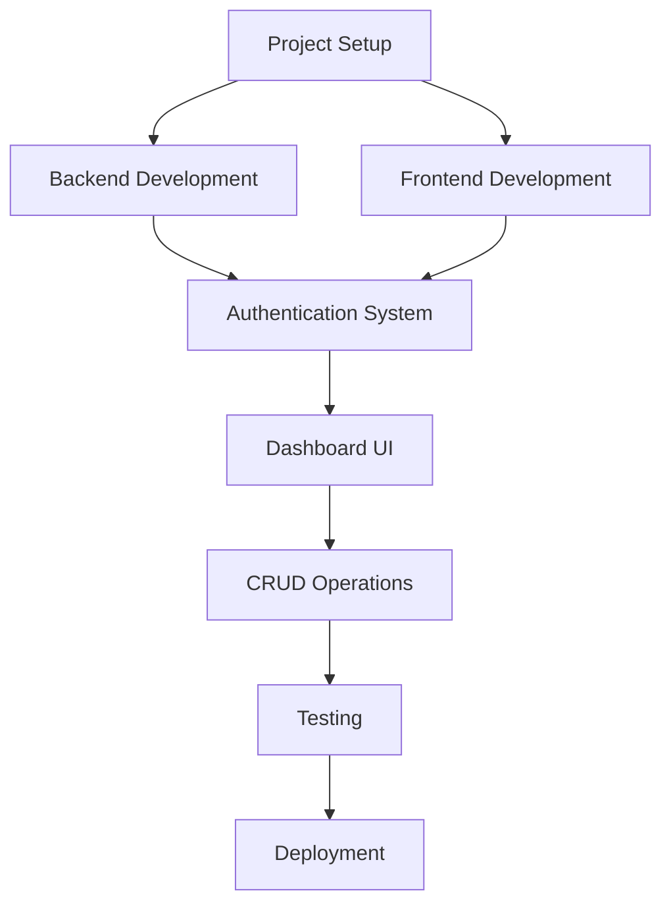

# Fullstack JavaScript Learning Path: Express & React

Welcome to the SantriKoding Fullstack JavaScript Learning Path! This comprehensive guide will take you from beginner to proficient in building fullstack applications using Express.js for the backend and React for the frontend. You'll build a complete dashboard application with user authentication and CRUD operations.

## Table of Contents

- [Project Overview](#project-overview)
- [Learning Objectives](#learning-objectives)
- [Prerequisites](#prerequisites)
- [Technology Stack](#technology-stack)
- [Curriculum Structure](#curriculum-structure)
  - [Backend with Express.js](#backend-with-expressjs)
  - [Frontend with React](#frontend-with-react)
- [Development Environment Setup](#development-environment-setup)
- [Project Roadmap](#project-roadmap)
- [Resources and References](#resources-and-references)
- [Contributing](#contributing)
- [License](#license)

## Project Overview

This learning path focuses on building a complete dashboard application with the following features:

- User authentication (registration, login, logout)
- Role-based access control
- Dashboard with data visualization
- CRUD operations for managing resources
- RESTful API design
- Responsive UI design

By the end of this course, you'll have a portfolio-worthy project that demonstrates your fullstack JavaScript skills.

## Learning Objectives

### Beginner Level
- Understand the fundamentals of Node.js and JavaScript ES6+
- Learn Express.js basics for building RESTful APIs
- Master React fundamentals and component-based architecture
- Implement user authentication and session management
- Work with databases (MongoDB/PostgreSQL)

### Intermediate Level
- Build scalable and maintainable code architecture
- Implement advanced React patterns (Hooks, Context API)
- Create secure REST APIs with proper validation
- Handle file uploads and data processing
- Implement real-time features with WebSockets

### Advanced Level
- Deploy applications to production environments
- Implement testing strategies (unit, integration, end-to-end)
- Optimize application performance
- Implement security best practices
- Work with microservices architecture

## Prerequisites

Before starting this learning path, you should have:

- Basic understanding of HTML, CSS, and JavaScript
- Node.js installed (version 14 or higher)
- npm or yarn package manager
- A code editor (VS Code recommended)
- Git for version control
- Basic command line knowledge

## Technology Stack

### Backend (Express.js)
- Node.js
- Express.js
- MongoDB with Mongoose OR PostgreSQL with Sequelize
- JWT for authentication
- bcrypt for password hashing
- Jest for testing

### Frontend (React)
- React 18+
- React Router v6
- Axios for HTTP requests
- Tailwind CSS or Material-UI for styling
- React Query or Redux for state management
- Jest and React Testing Library for testing

## Curriculum Structure

### Backend with Express.js

#### Module 1: Express.js Fundamentals
- Setting up Express.js project
- Understanding middleware
- Creating routes and controllers
- Working with HTTP methods (GET, POST, PUT, DELETE)
- Request and response handling

#### Module 2: Database Integration
- Setting up MongoDB or PostgreSQL
- Creating models and schemas
- CRUD operations with database
- Data validation and error handling
- Relationships and associations

#### Module 3: Authentication & Authorization
- User registration and login
- Password hashing with bcrypt
- JWT implementation
- Session management
- Role-based access control

#### Module 4: Advanced Express.js
- File uploads and storage
- Email integration
- Error handling middleware
- Logging and monitoring
- API documentation with Swagger

#### Module 5: Testing & Deployment
- Unit and integration testing with Jest
- Environment configuration
- Security best practices
- Performance optimization
- Deployment to cloud platforms (Heroku, Vercel, etc.)

### Frontend with React

#### Module 1: React Fundamentals
- Setting up React project with Vite or Create React App
- JSX syntax and components
- Props and state management
- Event handling
- Conditional rendering and lists

#### Module 2: React Router and Navigation
- Setting up routes
- Programmatic navigation
- Route parameters and query strings
- Protected routes
- Nested routes

#### Module 3: State Management
- Component state with useState
- Side effects with useEffect
- Context API for global state
- Redux or React Query for complex state
- Form handling and validation

#### Module 4: UI Components and Styling
- Component libraries (Material-UI, Ant Design)
- CSS frameworks (Tailwind CSS)
- Responsive design
- Custom hooks
- Performance optimization

#### Module 5: Advanced React
- Authentication flow implementation
- CRUD operations with API integration
- Real-time updates with WebSockets
- Testing with Jest and React Testing Library
- Deployment and environment configuration

## Development Environment Setup

### Prerequisites Installation

1. Install Node.js (version 14 or higher) from [nodejs.org](https://nodejs.org/)
2. Install a code editor (VS Code recommended)
3. Install Git from [git-scm.com](https://git-scm.com/)

### Project Setup

1. Clone the repository:
   ```bash
   git clone https://github.com/santrikoding/learn-express-react.git
   cd learn-express-react
   ```

2. Install backend dependencies:
   ```bash
   cd backend
   npm install
   ```

3. Install frontend dependencies:
   ```bash
   cd frontend
   npm install
   ```

4. Set up environment variables:
   - Create `.env` files in both `backend` and `frontend` directories
   - Configure database connection strings
   - Set up JWT secrets and API keys

5. Run the development servers:
   ```bash
   # In backend directory
   npm run dev
   
   # In frontend directory
   npm run dev
   ```

## Project Roadmap



### Phase 1: Foundation (Weeks 1-2)
- Environment setup
- Express.js basics
- React fundamentals
- Simple API endpoints
- Basic UI components

### Phase 2: Core Features (Weeks 3-4)
- Database integration
- User authentication
- React Router implementation
- State management
- API integration

### Phase 3: Advanced Features (Weeks 5-6)
- Role-based access control
- Dashboard components
- CRUD operations
- Form validation
- Error handling

### Phase 4: Polish & Deploy (Weeks 7-8)
- Testing implementation
- Performance optimization
- Security enhancements
- Documentation
- Deployment

## Resources and References

### Official Documentation
- [Express.js Documentation](https://expressjs.com/)
- [React Documentation](https://reactjs.org/)
- [Node.js Documentation](https://nodejs.org/)
- [MongoDB Documentation](https://docs.mongodb.com/)
- [PostgreSQL Documentation](https://www.postgresql.org/docs/)

### Recommended Learning Resources
- [MDN Web Docs](https://developer.mozilla.org/)
- [freeCodeCamp](https://www.freecodecamp.org/)
- [The Net Ninja YouTube Channel](https://www.youtube.com/c/TheNetNinja)
- [Traversy Media YouTube Channel](https://www.youtube.com/c/TraversyMedia)

### Tools and Utilities
- [Postman](https://www.postman.com/) - API testing
- [MongoDB Compass](https://www.mongodb.com/products/compass) - Database GUI
- [pgAdmin](https://www.pgadmin.org/) - PostgreSQL administration
- [Git](https://git-scm.com/) - Version control

## Contributing

We welcome contributions to improve this learning path! Here's how you can contribute:

1. Fork the repository
2. Create a new branch for your feature or bug fix
3. Make your changes
4. Write tests if applicable
5. Commit your changes with a clear message
6. Push to your fork
7. Create a pull request

Please ensure your code follows the existing style and includes appropriate documentation.

## License

This project is licensed under the MIT License - see the [LICENSE](LICENSE) file for details.

---

Happy coding from SantriKoding! 🚀